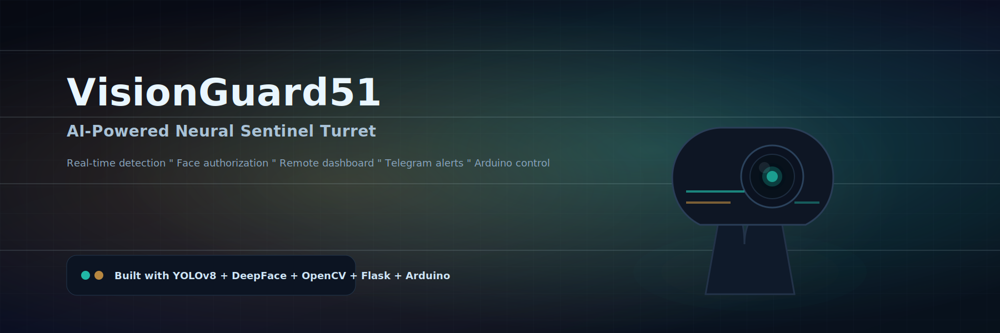
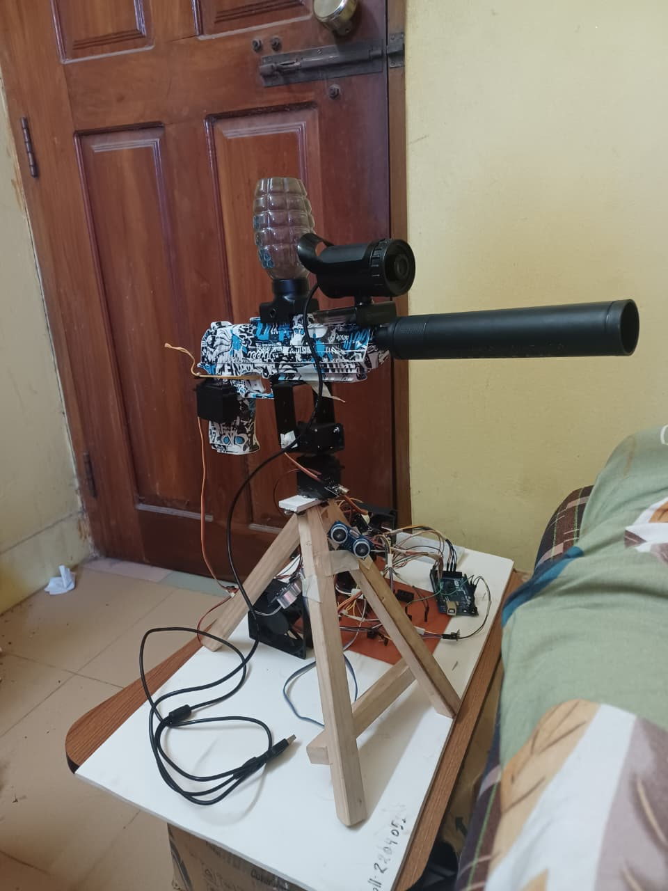
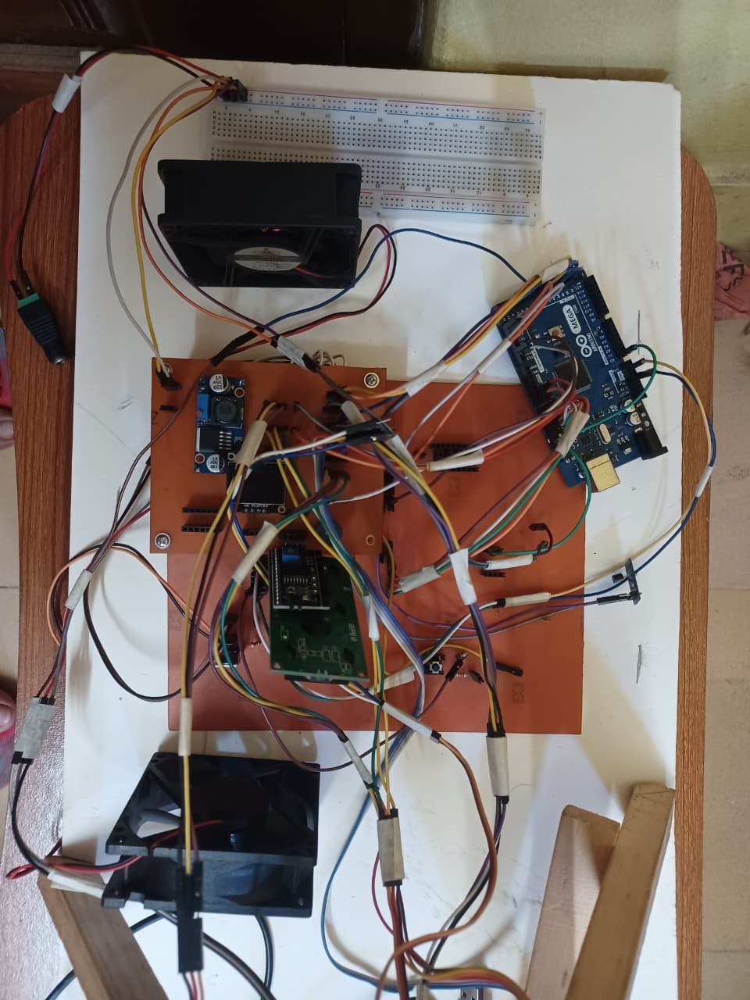
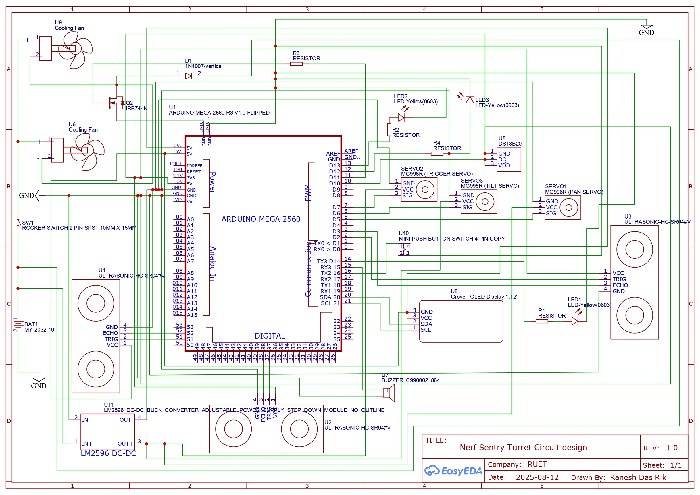

<p align="center">
  
</p>

<p align="center">
  <b>VisionGuard51: AI-Powered Neural Sentinel Turret</b><br/>
  A real-time perception + authorization pipeline with dashboard control, serial hardware integration, and alerting.
</p>

<p align="center">
  
  
  
  
  
</p>

<p align="center">
  
  
</p>

<p align="center">
  <a href="#the-vibe">The vibe</a> •
  <a href="#what-it-does">What it does</a> •
  <a href="#system-overview">System overview</a> •
  <a href="#quickstart-windows">Quickstart</a> •
  <a href="#models--weights">Models</a> •
  <a href="#dashboard">Dashboard</a> •
  <a href="#api--endpoints">API</a> •
  <a href="#serial-protocol-arduino">Serial protocol</a> •
  <a href="#troubleshooting">Troubleshooting</a>
</p>

## The vibe

VisionGuard51 is a “single script, many subsystems” build: one Python entrypoint that simultaneously:

- ingests video,
- runs neural inference,
- performs authorization checks,
- streams telemetry + video to a dashboard,
- talks to hardware over serial,
- and sends remote alerts.

If you like projects that feel like a **mission control panel**—this is that.

## What it does

- **Perception**: YOLOv8 detects **people** + **faces** in real time.
- **Authorization**: DeepFace (ArcFace) checks face crops against `authorized_db/`.
- **Targeting**: emits target centerpoints and tracking data.
- **Remote ops**: Flask dashboard with **MJPEG** video + **WebSocket** status updates.
- **Commands**: HTTP endpoint translates button presses into serial commands for Arduino.
- **Alerts**: Telegram text + photo evidence when an **unauthorized** face is seen.

## System overview

<p align="center">
  
</p>

## Capabilities (detailed)

- **Dual-model detection**
  - **Person detector**: gates “human present” and supports target selection.
  - **Face detector**: produces face crops for recognition/authorization.
- **Identity pipeline**
  - Enrollment-ready flow (script manages `authorized_db/` structure).
  - DeepFace calls are throttled to keep the loop responsive.
- **Two operating modes**
  - **SEMI‑AUTO**: requires approval (`F` → `Y/N`).
  - **FULL‑AUTO**: autonomous engage logic (only for controlled demos/tests).
- **Observability-first**
  - Status object contains mode, targets, distances/telemetry (if hardware provides it), and timestamps.

## Repository layout

```text
.
├─ basic_face_detection.py        # Main entrypoint (camera + models + web + serial)
├─ assets/                        # README images
│  ├─ visionguard51-banner.svg
│  ├─ visionguard51-overview.svg
│  ├─ project-1.jpg
│  ├─ project-2.jpg
│  └─ diagram.jpg
├─ authorized_db/                 # Authorized faces (ignored by git)
├─ dataset/                       # Enrollment/capture data (ignored by git)
└─ README.md
```

## Tech stack

- **Python**: orchestration + realtime loop
- **OpenCV**: camera capture, image ops, encoding
- **Ultralytics YOLOv8**: detection (`yolov8n.pt`, `yolov8n-face.pt`)
- **DeepFace (ArcFace)**: authorization/recognition
- **Flask + Flask-SocketIO**: dashboard + websocket telemetry
- **PySerial**: Arduino link
- **Requests**: Telegram Bot API

## Quickstart (Windows)

### 0) Before you run (checklist)

- **Camera** plugged in and not used by another app (Zoom/OBS/Discord can “steal” it).
- **Arduino** plugged in.
- You know your Arduino **COM port** (Device Manager → Ports).

### 1) Create a virtual environment

```powershell
python -m venv .venv
.venv\Scripts\Activate.ps1
python -m pip install -U pip
```

### 2) Install dependencies

```powershell
pip install opencv-python numpy flask flask-socketio pyserial deepface ultralytics requests
```

### 3) Configure the script

Open `basic_face_detection.py` and update:

- **Serial**: `SERIAL_PORT` (default: `COM7`) and confirm `BAUD_RATE` (default: `9600`)
- **Telegram**: `TELEGRAM_BOT_TOKEN`, `TELEGRAM_CHAT_ID`

Security recommendation:
- **Do not commit real tokens**. Move secrets to environment variables (e.g., `TELEGRAM_BOT_TOKEN`, `TELEGRAM_CHAT_ID`) and load them at runtime.

### 4) Run

```powershell
python basic_face_detection.py
```

## Models / weights

This repo intentionally **does not include large model weights** (GitHub blocks files >100MB). Download locally and keep them out of git.

### YOLOv8 weights

Place these next to the script (or adjust paths in code):

- `yolov8n.pt`
- `yolov8n-face.pt`

### OpenPose (MPI) model (if you use it)

- **Direct URL**: `http://vcl.snu.ac.kr/OpenPose/models/pose/mpi/pose_iter_160000.caffemodel`
- **Official reference script**: `https://raw.githubusercontent.com/CMU-Perceptual-Computing-Lab/openpose/master/models/getModels.sh`

Download to project root:

```powershell
Invoke-WebRequest -Uri "http://vcl.snu.ac.kr/OpenPose/models/pose/mpi/pose_iter_160000.caffemodel" -OutFile "pose_iter_160000.caffemodel"
```

## Dashboard

When the script starts, it launches the web UI:

- **Local**: `http://localhost:5000`
- **LAN**: `http://<your-ip>:5000`

What you get:

- **Live video** (MJPEG)
- **Live status** (WebSocket updates)
- **Command buttons** that map to serial commands

## API / endpoints

- **Video**: `GET /video_feed`
- **Status**: `GET /api/status`
- **Command**: `POST /api/command`

Example:

```json
{ "command": "M" }
```

## Serial protocol (Arduino)

VisionGuard51 sends newline-delimited commands over serial, e.g. `M\n`, `F\n`, `Y\n`.

Known web commands (firmware decides the final behavior):

| Command | Intended meaning |
|---|---|
| `M` | Toggle mode |
| `F` | Request fire / open approval window |
| `Y` | Approve |
| `N` | Deny |
| `A` | Firmware-defined |
| `X` | Firmware-defined |
| `F_AUTO` | Firmware-defined |

Firmware safety best-practices (strongly recommended):

- **Physical interlock** input (must be ON to allow actuation)
- **E‑stop** (hard power cut to actuation)
- **Rate limits** on motion
- **Safe boot** (no actuation until explicit command)

## Repo hygiene

- Weight files are ignored by default (`*.caffemodel`, `*.pt`, etc.).
- `authorized_db/` is ignored (privacy).
- Keep your `dataset/` local; don’t push personal images.

## Troubleshooting

- **Camera shows “No Camera Feed”**
  - Close other camera apps and restart.
  - Try a different camera/USB port.
- **YOLO weights fail to load**
  - Confirm `yolov8n.pt` and `yolov8n-face.pt` exist where the script expects them.
- **Arduino won’t connect**
  - Confirm the COM port and baud rate.
  - Check Device Manager and verify the board drivers.
- **Telegram alerts not sending**
  - Verify token + chat id and ensure the bot can message the chat.
  - Try a different network if HTTP is blocked.

## Safety & ethics

This project is for **research/education**. If you attach actuation hardware:

- Use **physical interlocks**, a hard **E‑stop**, and conservative defaults.
- Never deploy where people can be harmed.
- Keep secrets out of git (move tokens to environment variables).

## License

Licensed under the **PolyForm Noncommercial 1.0.0** license.

- **Allowed**: testing, study, learning, research, hobby use
- **Not allowed**: selling, commercializing, or marketing this project (or derivatives)

**Attribution is required** for any redistribution (see the `Required Notice:` lines in `LICENSE`).

See `LICENSE` for full terms.
